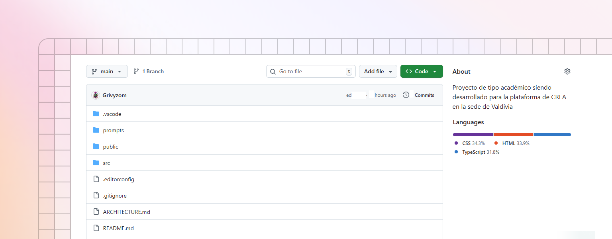

# Codigo del Proyecto

<figure><figcaption></figcaption></figure>

Para poder clonar el codigo base del repositorio en tu computadora debes dirigirte a la siguiente ruta:



#### Ahora deberás seguir las siguientes indicaciones:

Con este comando crearás la carpeta donde se clonará el repositorio con el código fuente.


```yaml
mkdir Github-Repositorios
```


Ahora debes ingresar a la ruta donde creaste la carpeta.

```
cd ../Github-Repositorios
```

Con el siguiente comando clonarás el código fuente.

```
git clone https://github.com/Grivyzom/Mockup-CREA
```

Es necesario que instales las dependencias necesarias para que el proyecto funcione.

```
npm install
```

Para finalizar debes iniciar el proyecto.

```
npm start
```


Want to learn about writing content from scratch? Head to the [Basics](../basics/editor.md) section to learn more.


GitBook supports importing content from many popular writing tools and formats. If your content already exists, you can upload a file or group of files to be imported.

<div data-full-width="false"><figure><figcaption></figcaption></figure></div>

### Sync a repository

GitBook also allows you to set up a bi-directional sync with an existing repository on GitHub or GitLab. Setting up Git Sync allows you and your team to write content in GitBook or in code, and never have to worry about your content becoming out of sync.
